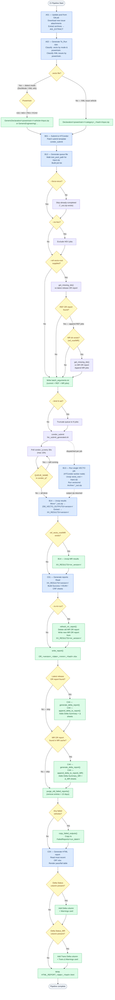

# CI/CD Pipeline Flow

```mermaid
flowchart TD
    START([CI Pipeline Start]) --> A01

    %% ── Pool preparation ──────────────────────────────────────────────────
    A01["A01 — Update pool from GitLab <br> Download new issue attachments <br>Extract archives → A01_EXTRACT"]
    A01 --> A02

    A02["A02 — Generate To_Run zips. <br> Classify .vecto by mode & powertrain. <br> Classify XML issues by powertrain."]
    A02 --> A02d1

    A02d1{".vecto file?"}
    A02d1 -->|"Yes — detect mode <br> (DeclMode / XML refs)"| A02d2
    A02d1 -->|"No — XML issue vehicle"| A02d3

    A02d2{Powertrain}
    A02d2 -->|ICE / HEV / PEV / FCHV| A02g["GenericDeclaration/&lt;powertrain&gt;/&lt;vehicle&gt;/input.zip or GenericEngineering/…"]

    A02d3["Declaration/&lt;powertrain&gt;/&lt;category&gt;_&lt;hash&gt;/input.zip"]

    A02g --> B01
    A02d3 --> B01

    %% ── HTCondor submission ────────────────────────────────────────────────
    B01["B01 — Submit to HTCondor <br> Patch submit template <br> condor_submit"]
    B01 --> B12

    B12["B12 — Generate queue file <br> Walk test_pool_path for input.zip <br> Build job list"]
    B12 --> B12d1

    B12d1{"--force-rerun?"}
    B12d1 -->|No| B12d2["Skip already-completed <br> (*_out.zip exists)"]
    B12d1 -->|Yes| B12d3

    B12d2 --> B12d3

    B12d3{"--no-hev?"}
    B12d3 -->|Yes| B12d4["Exclude HEV jobs"]
    B12d3 -->|No| B12d5

    B12d4 --> B12d5

    B12d5{"--ref-vecto-root <br> supplied?"}
    B12d5 -->|Yes| B12d6["get_missing_ids() <br> vs latest release OR report"]
    B12d5 -->|No| B12write

    B12d6 --> B12d7{"REF OR report <br> found?"}
    B12d7 -->|No| B12write
    B12d7 -->|Yes — append REF jobs| B12d8

    B12d8{"MR dir exists? <br> (ref_root/MR)"}
    B12d8 -->|Yes| B12d9["get_missing_ids() <br> vs MR OR report <br> Append MR jobs"]
    B12d8 -->|No| B12write

    B12d9 --> B12write["Write batch_arguments.txt <br> (current + REF + MR jobs)"]
    B12write --> B01lim

    B01lim{"--limit N set?"}
    B01lim -->|Yes| B01trunc["Truncate queue to N jobs"]
    B01lim -->|No| B01submit

    B01trunc --> B01submit["condor_submit <br> htc_submit_generated.sh"]
    B01submit --> B01poll

    B01poll["Poll condor_q every 30s <br> (max 10h)"]
    B01poll --> B01d1{"QUEUE_NAME <br> in condor_q?"}
    B01d1 -->|Yes — still running| B01poll
    B01d1 -->|No — all done| B14

    %% ── Result extraction ──────────────────────────────────────────────────
    B14["B14 — Unzip results <br> Move *_out.zip → Z00_VECTO_OUTPUTS/&lt;version&gt;/ <br> Extract → XX_RESULTS/&lt;version&gt;/"]
    B14 --> B14d1

    B14d1{"ref_vecto_root/MR <br> exists?"}
    B14d1 -->|Yes| B14mr["B14 — Unzip MR results <br> XX_RESULTS/&lt;mr_version&gt;/"]
    B14d1 -->|No| C01
    B14mr --> C01

    %% ── Report generation ──────────────────────────────────────────────────
    C01["C01 — Generate reports <br> Read XX_RESULTS/&lt;version&gt;/ <br> Build Success / VSUM / CRF sheets"]
    C01 --> C01d1

    C01d1{"--is-mr-run?"}
    C01d1 -->|Yes| C01mr["refresh_mr_report() <br> Delete old MR OR report <br> Write new MR OR report <br> from XX_RESULTS/&lt;mr_version&gt;/"]
    C01d1 -->|No| C01write

    C01mr --> C01write["write_report() <br> OR_&lt;version&gt;_&lt;date&gt;_&lt;nnnn&gt;_&lt;hash&gt;.xlsx"]
    C01write --> C01d2

    C01d2{"Latest release <br> OR report found?"}
    C01d2 -->|Yes| C01ref["C44 — generate_delta_report() <br> C44 — append_delta_to_report() <br> Adds Delta Summary + Δ sheets"]
    C01d2 -->|No — skip| C01d3

    C01ref --> C01d3

    C01d3{"MR OR report <br> found in MR cache?"}
    C01d3 -->|Yes| C01mrd["C44 — generate_delta_report() <br> C44 — append_delta_to_report(_MR) <br> Adds Delta Summary_MR + Δ_MR sheets"]
    C01d3 -->|No — skip| C01fail

    C01mrd --> C01fail

    C01fail["purge_old_failed_reports() <br> (remove entries > 10 days)"]
    C01fail --> C01d4{"Any failed <br> vehicles?"}
    C01d4 -->|Yes| C01copy["copy_failed_outputs() <br> Copy to FailedReports/&lt;run_label&gt;/"]
    C01d4 -->|No| C04

    C01copy --> C04

    %% ── HTML report ────────────────────────────────────────────────────────
    C04["C04 — Generate HTML report <br> Read most recent OR*.xlsx <br> Render pass/fail table"]
    C04 --> C04d1{"Delta Status <br> column present?"}
    C04d1 -->|Yes| C04delta["Add Delta column <br> + Warnings card"]
    C04d1 -->|No| C04d2

    C04delta --> C04d2

    C04d2{"Delta Status_MR <br> column present?"}
    C04d2 -->|Yes| C04mr["Add Trans Delta column <br> + Trans Δ Warnings card"]
    C04d2 -->|No| C04out

    C04mr --> C04out["Write HTML_REPORT_&lt;date&gt;_&lt;hash&gt;.html"]
    C04out --> END([Pipeline complete])

    %% ── Worker node (HTCondor) ─────────────────────────────────────────────
    B13["B13 — Run single VECTO job <br> (HTCondor worker node) <br> Unzip vecto_root + input.zip <br> Run vectocmd <br> Archive *_out.zip"]
    B01submit -.->|"dispatched per job"| B13
    B13 -.->|"output zip returned"| B14

    %% ── Styling ────────────────────────────────────────────────────────────
    classDef script fill:#dbeafe,stroke:#2563eb,color:#1e3a5f
    classDef decision fill:#fef9c3,stroke:#ca8a04,color:#713f12
    classDef io fill:#dcfce7,stroke:#16a34a,color:#14532d
    classDef endpoint fill:#f1f5f9,stroke:#64748b,color:#1e293b

    class A01,A02,B01,B12,B14,B13,C01,C04 script
    class A02d1,A02d2,B01lim,B01d1,B12d1,B12d3,B12d5,B12d7,B12d8,B14d1,C01d1,C01d2,C01d3,C01d4,C04d1,C04d2 decision
    class A02g,A02d3,B12write,B14mr,C01mr,C01write,C01ref,C01mrd,C01fail,C01copy,C04delta,C04mr,C04out io
    class START,END endpoint
```
